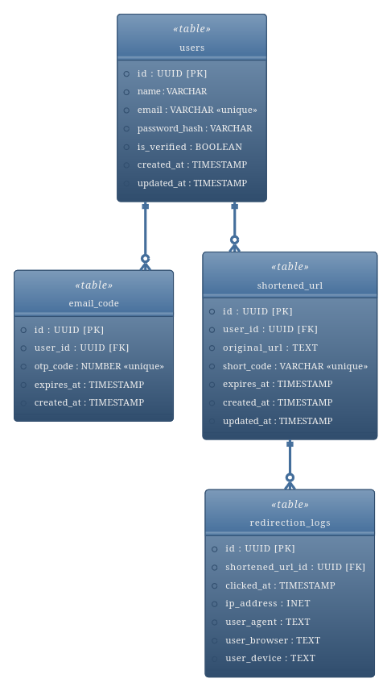

### Key Entities

**1. Users**

This schema is for storing details about the users who sign up in the application.

- Table name: users.
- Attributes: id, name, email, password, isVerified, createdAt, updatedAt.
- Relationships: One user can have may shortened URLs.

**2. Email Verification Code / Token**

This schema is for storing the one time password (OTP) tokens. Relevant values will be automatically inserted when the
user signs up. While verifying the user, these records will be checked.

- Table name: email_code.
- Attributes: id, userId, code, expiresAt, createdAt.
- Relationships: Belongs to a single User Email.

**3. Shortened URL**

This Schema is for storing the actual details about the URLs.

- Table name: shortened_url.
- Attributes: id, userId, originalUrl, shortCode, expiresAt, createdAt, updatedAt.
  - The shortCode is the unique string used to redirect users (e.g. abc123 in https://ourdomain.com/abc123).
  - expiredAt would define when the link expires and becomes invalid.
- Relationships: Each shortened URL is owned by a single User.

**4.Analytics Record**

This schema is for storing the various analytical records of a particular shortened URL. Each record represents one
click on a shortened URL.

- Table name: Analytics.
- Attributes: id, shortenedUrlId, clickedAt, ipAddress, userAgent.
- Relationships: Each click record is associated with exactly one shortened URL.

### Entity-Relationship Diagram

