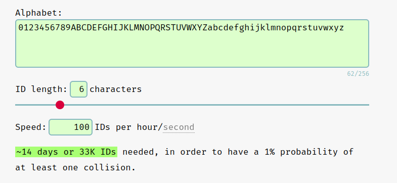
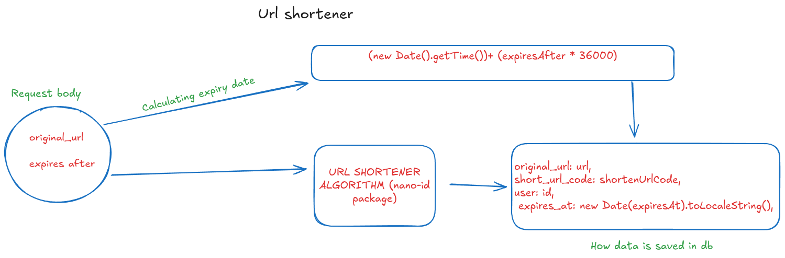
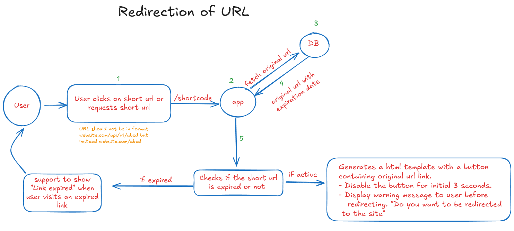

# DESIGN FLOW FOR URL SHORTENER

This documentation is based on the main business logic of URL shortener . Basically a long URL or original URL is sent
by user including the hours after which the URL expires which is then converted into a short URL using **“URL shortening
algorithm”** and whenever user clicks the short URL link generated it is then redirected to long/original URL. If the
short URL expires then the URL won’t work but it is not deleted from the database so that we can keep on generating
unique URL. We have used the package **nano-id** for URL shortening where we have decided to keep the size 6. All the
routes used in URL is protected and only authorized (logged in and verified) users can access those routes.

<a href="https://classic.yarnpkg.com/en/package/nanoid">NANO-ID</a>

A tiny, secure, URL-friendly, unique string ID generator for JavaScript.

If we use custom alphabets _`0123456789ABCDEFGHIJKLMNOPQRSTUVWXYZabcdefghijklmnopqrstuvwxyz`_ and size of 6 and assume
that 100 URLs are generated in an hour then ~14 days or 33K URLs needed, in order to have a 1% probability of at least
one collision.

**Url Collision Probabilty**

## REQUEST BODY

To create short URL’s we need two data from request body i.e `url` and `expiresAfter`. `url` consists of original URL
and `expiresAfter` contains the time validity of the short URL until which the URL is active. It is given in ‘hours’. If
user inputs 20 then it means after 20 hour.

    @IsUrl()
    url: string;

    @IsNumber()
    @IsNotEmpty()
    expiresAfter: number;

## URL ENTITY

URL’s are saved in database within a table named `url` .

    @PrimaryGeneratedColumn('uuid')
    id: string;

    @Column()
    original_url: string;

    @Column()
    short_url_code: string;

    @ManyToOne(() => User, (user) => user.id)
    user: User;

    @CreateDateColumn({ type: 'timestamp' })
    created_at: Date;

    @Column({ type: 'timestamp' })
    expires_at: Date;

    @UpdateDateColumn({ type: 'timestamp' })
    updated_at: Date;

_Every URL has many to one relationship with the user i.e one user can have many URLs , so we every URL created has user
id save with it._

## ROUTES

**POST** `/url/shorten` _Create short URL from given long url_

**GET** `/url` _Get all the active short URL’s associated with the user._

**GET** `/url/expired` _Get all the expired short URL's associated with the user._

**GET** `/url/:shortCode`_ Redirect to original URL and send a HTML template as response._

## BUSINESS LOGIC

When the user tends to create a short URL , user must provide details as required by the request body. If the data
inserted by user is valid then it hits the URL shortening route which then runs the method that calculates the expiry
date at first which is initially in milliseconds but later converted into local time including the time zone. After that
**nano-id** package is used to create a _6 digit short code_ using the size and custom alphabets provided. On receiving
the short code , everything given on URL entity is saved. When URL hits the new short URL `<domain_name>/short_code` it
redirects to a HTML template which consists of a html button which is clickable only after a few seconds. On clicking
the button it redirects us to the original site. If the data inserted by user is not valid it throws error based on the
error caught. And if the short URL is expired it becomes inactive and doesn’t redirect anywhere throwing an error.

## REDIRECTION OF URL

Things to consider for redirection of URL:

- There should be a confirmation button that says _“Do you want to be redirected to the site?"_

- The user should not be able to click the button for 3 seconds until they read a disclaimer.

- URL should not be in format `website.com/api/v1/abcd` but instead `website.com/abcd`.

